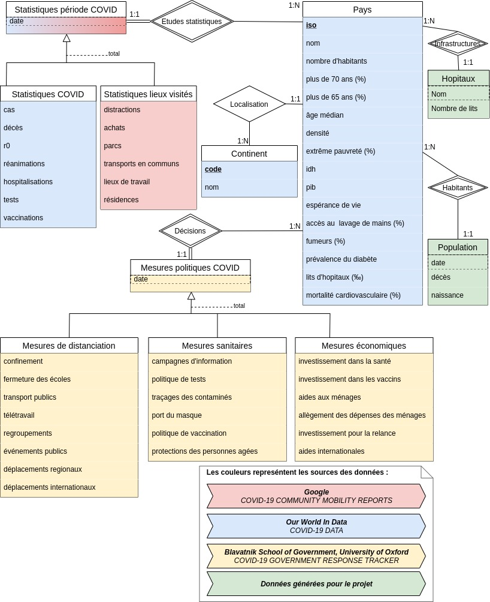
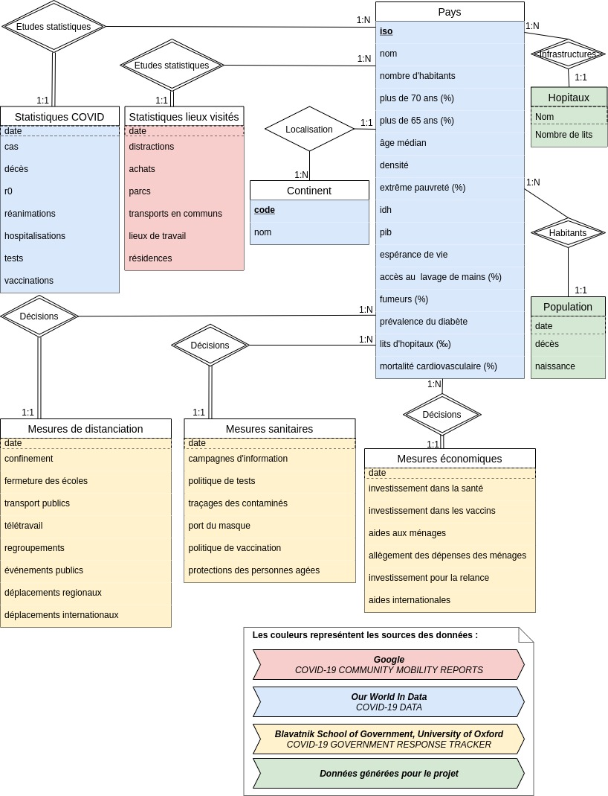

# Bases de données & Décisions COVID-19  
  
  
**Auteurs : [Joël Hamilcaro](https://github.com/Joel-Hamilcaro/) et [Jie Tu](https://github.com/jie-tu)**


# Introduction

Notre projet, que l'on pourrait intituler « Base de données & Décisions Covid-19 », cherche à modéliser les mesures prises, par les différents pays, pour faire face à l'épidémie de COVID-19. Nous voulons y intégrer des données assez riches permettant d'établir des liens entre les mesures prises, les éventuelles causes de ces mesures, et leurs conséquences. Les décisions étant majoritairement prises au niveau étatique, nous allons représenter nos données à l'échelle internationale. Par conséquent, les données locales ou régionales ne seront pas présentes.

Afin de réaliser ce projet, nous allons nous focaliser sur les données suivantes :  

  - Des données sur les décisions prises par les pays  
  (mesures de confinement, port du masque, ...)  

  - Des données relatives aux pays, indépendantes de l'épidémie  
  (densité de population, proportion de personnes âgées, prévalence du diabète, PIB ... )  

  - Des données sur l'évolution de l'épidémie  
  (nombre de cas, hospitalisations, ...)  

  - Des données sur l'évolution des activités de la population  
  (fréquentations de parcs/restaurants, sortie pour faire des achats, ... )  

Ainsi, lorsque de la base de données est opérationnelle, nous pouvons par exemple :

  - afficher les mesures prises, en fonction de la situation sanitaire/démographique/économique des pays.
  - afficher, pour chaque pays, l'évolution épidémique avant et après la mise en place du port du masque.
  - observer, pour chaque pays, si la population respecte les mesures de confinement.

# Sources des données

Nous allons présenter succinctement les sources des données que nous avons importées pour ce projet.  

### Blavatnik School of Government, University of Oxford : COVID-19 Government response tracker   

Ces données cataloguent les mesures de distanciation, les mesures sanitaires, et les mesures économiques, prises par les différents pays pour faire face à l'épidémie.  

  - <https://www.bsg.ox.ac.uk/research/research-projects/covid-19-government-response-tracker>

### Our World in Data  

Cette plateforme recense les données dont nous avons besoin concernant les données relatives aux pays (indépendantes de l'épidémie) et les données concernant l'évolution de l'épidémie.

  - <https://ourworldindata.org/coronavirus>
  - <https://github.com/owid/covid-19-data/tree/master/public/data>

### Google COVID-19 community mobility reports    

Cette source de données nous fournit des informations à propos de la localisation de la population, en se servant des renseignements agrégés qui sont utilisés dans des produits tels que Google Maps.

  - <https://www.google.com/covid19/mobility/>

# Modélisation entité-relation

Dans un premier temps, voici la modélisation entité-relation ci-dessous, mise-à-jour en tenant compte des remarque lors de la pré-soutenance.



Voici la modélisation entité-relation que nous obtenons, après restructuration des spécialisations.  




# Mise en place du schéma relationnel

Enfin, à partir de notre modèle, nous avons mis en place le schéma relationnel et les contraintes suivantes sur les relations.

**Convention  :**   
  - Les attributs <ins>**en gras**</ins> représentent les clés.   
  - Les attributs précédés d'un # représentent les clés étrangères.   
  - On ne précise pas les contraintes "évidentes" (NOT NULL, UNIQUE) sur les <ins>**clés**</ins>.

###  Schéma relationnel et contraintes

- Continent( <ins>**code**</ins> , nom )    
  - code : chaîne de 3 caractères   

- Pays( <ins>**iso**</ins> , #code , nom , hab , pl65, pl70 , age_md , dens , pvr_ex , idh , pib , es_vie , lavage , fum , pr_diab , m_card , lits)   
  - Pays(code) $⊆$ Continent(code)
  - Pays(code) NOT NULL
  - iso: chaîne de 3 caractères
  - nom: chaîne de moins de 45 caractères
  - hab,  age_md, dens, pib, es_vie $⩾$  0
  - pvr_ex, lavage, fum, p_diab , m_card, pl65, pl70 $∈$ [0;100]
  - pl65 $⩾$ pl70
  - idh $∈$ [0;1]
  - lits $∈$ [0;1000]   

- Hopitaux( <ins>**#iso , nom**</ins> , lits  )
  - Hopitaux(iso) $⊆$ Pays(iso)
  - lits $⩾$ 0
- Population( <ins>**#iso , nom**</ins> , deces, naissance  )
  - Population(iso) $⊆$ Pays(iso)
  - deces $⩾$ 0
  - naissance $⩾$ 0
- Stats_COVID( <ins>**#iso , date**</ins>  , cas , deces , r0 , rea , hosp , test , vacc )
  - Stats_COVID(iso) $⊆$ Pays(iso)
  - cas, deces, r0, rea, hosp, test, vacc $⩾$  0   


- Stats_lieux( <ins>**#iso , date**</ins> , dist , achat , parc , transp , travail , resid )
  - Stats_lieux(iso) $⊆$ Pays(iso)   


- Pol_Distanciation( <ins>**#iso , date**</ins>, conf , ecole , traffic ,  teletra , rassem , evt_pub , dpl_reg , dpl_nat )
  - Pol_Distanciation(iso) $⊆$ Pays(iso)
  - conf $∈$ {0,1,2,3}
  - ecole $∈$ {0,1,2,3}
  - traffic $∈$ {0,1,2}
  - teletra $∈$ {0,1,2,3}
  - rassem $∈$ {0,1,2,3,4}
  - evt_pub $∈$ {0,1,2}
  - dpl_reg $∈$ {0,1,2}
  - dpl_int $∈$ {0,1,2,3,4}   


- Pol_Sanitaire( <ins>**#iso , date**</ins>, info , pol_test , trace , masque , pol_vacc , pro_age )
  - Pol_Sanitaire(iso) $⊆$ Pays(iso)
  - info $∈$ {0,1,2}
  - pol_test $∈$ {0,1,2,3}
  - trace $∈$ {0,1,2}
  - masque $∈$ {0,1,2,3,4}
  - pol_vacc $∈$ {0,1,2,3,4,5}
  - pro_age $∈$ {0,1,2,3}   


- Pol_Eco( <ins>**#iso , date**</ins>, inv_sante , inv_vacc , aide_mng , alle_mng , inv_rel , aide_int )
  - Pol_Eco(iso) $⊆$ Pays(iso)
  - aide_mng $∈$ {0,1,2}   

**Remarque :** Les attributs des tables **`Pol_XXX`** suivent les mêmes conventions que dans la documentation des données sources. Par exemple, pour la table **`Pol_Distanciation`**, la signification de la valeur de l'attribut **`ecole`** est la suivante :   

  - 0 - aucune mesure
  - 1 - recommande la fermeture ou l'ouverture de toutes les écoles avec des modifications entraînant des différences significatives par rapport aux opérations non-Covid-19
  - 2 - exiger la fermeture (seulement certains niveaux ou catégories, par exemple seulement le lycée, ou seulement les écoles publiques)
  - 3 - exiger la fermeture des écoles pour tous les niveaux
  - NULL - Pas de données disponible    


###  Normalisation   


Les relations du schéma relationnel ci-dessus sont déjà en Forme Normale de Boyce-Codd (FNBC). En effet, par construction, elles sont en 1NF (les attributs sont atomiques). De plus, elles sont en 2NF car chaque attribut ne faisant pas partie de la clé dépend de toute la clé. En effet, les attributs non-clés des relations **`Stats_XXX`** et **`Pol_XXX`** dépendent à chaque fois de la date et du pays. Par ailleurs, elles sont en 3NF car il n'y a pas de relations de dépendance entre les attributs non-clés. Enfin elles sont en FNBC parce que les attributs non-clés n'impliquent pas de dépendance sur une partie de la clé. En effet, les attributs portant sur des statistiques et les attributs portant sur les décisions, ne déterminent pas le pays ni la date.    


# Description SQL du Schéma de données et contraintes d'intégrité

```
TABLE Continent
  code CHAR(2) NOT NULL
  nom  VARCHAR(25) NOT NULL
  PRIMARY KEY (code)

TABLE Pays
  code CHAR(2) references Continent(code)
  iso  CHAR(3) NOT NULL
  nom  VARCHAR(45)  NOT NULL
  hab  INT CHECK(hab>=0)
  pl70  FLOAT  CHECK(pl70>=0 AND pl70<=100)
  pl65  FLOAT  CHECK(pl65>=0 AND pl65<=100 AND pl65 >= pl70 )
  age_md FLOAT  CHECK(age_md >= 0 )
  surface FLOAT  CHECK(surface >= 0 )
  pv_ex FLOAT  CHECK(pv_ex>=0 AND pv_ex<=100)
  idh FLOAT  CHECK(idh>=0 AND idh <=1)
  pib FLOAT  CHECK(pib>=0)
  e_vie FLOAT  CHECK(e_vie>=0 )
  l_mains FLOAT  CHECK(l_mains>=0 AND l_mains<=100)
  fumeurs FLOAT  CHECK(fumeurs >=0 AND fumeurs<=100)
  pr_diab FLOAT  CHECK(pr_diab >= 0 AND pr_diab<= 100)
  lits FLOAT  CHECK(lits>=0)
  m_card FLOAT  CHECK(m_card>=0 AND m_card<=1000)
  PRIMARY KEY (iso)

TABLE Population
  iso CHAR(3) references Pays (iso)
  date DATE  NOT NULL
  deces INT CHECK(deces >=0)
  naiss INT CHECK(naiss>=0)
  PRIMARY KEY (iso,date)

TABLE Statistiques_covid
  date  DATE  NOT NULL
  iso CHAR(3) references Pays (iso)
  cas INT CHECK (cas>=0 )
  deces INT CHECK (deces>=0)
  r0 FLOAT CHECK (r0>=0)
  rea INT CHECK (rea>=0)
  hosp INT CHECK (hosp>=0)
  tests INT CHECK (tests>=0)
  vacc INT CHECK (vacc>=0)
  PRIMARY KEY (iso,date)

TABLE Statistiques_lieux_visites
  date DATE  NOT NULL
  iso CHAR(3) references Pays (iso)
  dist FLOAT  
  achat FLOAT
  parc FLOAT
  transp  FLOAT
  travail FLOAT
  resid FLOAT
  PRIMARY KEY (iso,date)

TABLE Mesures_distanciations
  date DATE  NOT NULL,
  iso CHAR(3) references Pays (iso),
  conf INT CHECK(conf>=0 AND conf<=3),
  ecole INT CHECK(ecole >=0 AND ecole<=3),
  traffic INT CHECK(traffic >=0 AND traffic <=2),
  teletra INT CHECK(teletra >=0 AND teletra <=3),
  rassem INT CHECK(rassem >=0 AND rassem<=4),
  evt_pub INT CHECK(evt_pub>=0 AND evt_pub<=2),
  dpl_reg INT CHECK(dpl_reg>=0 AND dpl_reg<=2),
  dpl_int  INT CHECK(dpl_int>=0 AND dpl_int<=4),
  PRIMARY KEY (iso,date)

TABLE Mesures_sanitaires
  date  DATE  NOT NULL
  iso CHAR(3) references Pays (iso)
  info INT CHECK(info>=0 AND info<=2)
  pol_test INT CHECK(pol_test>=0 AND pol_test<=3)
  trace INT CHECK(trace>=0 AND trace<=2)
  masque INT CHECK(masque>=0 AND masque<=4)
  pol_vacc INT CHECK(pol_vacc>=0 AND pol_vacc<=5)
  pro_ages  INT CHECK(pro_ages>=0 AND pro_ages<=3)

TABLE Mesures_economiques
  date DATE  NOT NULL
  iso CHAR(3) references Pays (iso)
  inv_sante  FLOAT  
  inv_vacc FLOAT  
  aides_mng INT CHECK(aides_mng>=0 AND aides_mng<=2)
  alle_mng INT CHECK(alle_mng>=0 AND alle_mng<=2)
  inv_rel FLOAT
  aides_int FLOAT
  PRIMARY KEY (iso,date)

TABLE Hopitaux
  nom VARCHAR(55)  NOT NULL
  iso CHAR(3) references Pays (iso)
  lits  INT CHECK(lits>=0)
  PRIMARY KEY (nom,iso)
```

# Import des données

## Migration des données

Nous avons importer et reformaté les données sources pour qu'elles soient exploitable dans notre base de données. Nous avons supprimer les redondances, utiliser la même convention entre les différente sources (par exemple, l'ISO alpha-3 pour identifier les pays). Ce reformatage a été fait à l'aide d'un script `Python`. Les données finales obtenues correspondent à celle présente dans le dépot (dossier `data/`).
Le script correspond au fichier `Migration_data.ipynb` (dossier `notebook/`).

## Génération des données

Afin d'enrichir le projet, nous avons générés certaines données à l'aide d'un script en langage `Python`.
Ces données sont celles sur les hôpitaux (nom de les hôpitaux, pays où ils se trouvent, nombre de lits par hôpital) et celles sur les fluctuations de la démographie (nombre de naissance et décès par jour par pays). Cependant, nous avons généré ces données de manière à ce que le nombre de lits total des hôpitaux d'un pays concorde avec le vrai nombre de lits d'hôpitaux de ce pays, tel qu'il est présent dans les données réelles. De plus, les données sur la population ont été générées pour que l'évolution de décès et naissance reste stable est stable et proche de la réalité.   

# Triggers, règles de gestions

Voici la liste des triggers et leurs description :

##  Trigger de mises à jours
- `AAB_Population_Pays_trigger : ` L'insertion des données dans la table Population (attributs naiss,décès) met à jour les données dans la   table Pays (nombre d'habitants).
(Fonction associée `hab_population_update`).
- `AAB_Covid_Pays_trigger : ` L'insertion des données dans la table Statistiques_Covid (attributs décès) met à jour les données dans la   table Pays (nombre d'habitants).
(Fonction associée `hab_deces_covid_update`).

- `AAA_Hopitaux_Pays_trigger : ` L'insertion des données dans la table Hopitaux (attributs lits) met à jour les données dans la   table Pays (nombre de lits pour 1000 personnes).
(Fonction associée `lits_update`).

- `AAA_Statistiques_lieux_visites_Pays_trigger : ` L'insertion des données dans la table Statistiques_lieux_visités met à jour les données dans la   table Pays (esperance de vie) mais de manière peu significative.
(Fonction associée `e_vie_update`).


- `AAA_Mesures_economiques_Pays_trigger : ` L'insertion des données dans la table Mesures_economiques met à jour les données dans la table Pays (pib par habitant).
(Fonction associée `pib_update`).

## Trigger de verifications de contraites

- `AAA_cas_hab_trigger : `  Dans la table Statistique_Covid, le nombre de cas, le nombre de personnes hospitalisés,le nombre de décès, le nombre de personnes en réanimation, le nombre de personnes testés, et le nombre de personnes vaccinés ne peuvent pas dépasser le nombre d'habitants (table Pays).
(Fonction associée `cas_constraint`).

- `AAA_deces_hab_trigger : `  Dans la table Population le nombre de décès ne peut pas dépasser le nombre d'habitants (table Pays).
(Fonction associée `deces_constraint`).

## Trigger de notifications

- `covid_notification_trigger` : informe l'utilisateur que certaines valeurs spéciales ont été introduites (le nombre de cas dépasse 10000, le nombre de décès dépasse 1000, ... )
(Fonction associée `covid_notification`).

- `lieux_visites_notification_trigger` et `Mesures_distanciations_notification_trigger` : informent  l'utilisateur que la plupart des gens ne respectent pas les mesures prévues par leur gouvernement.
(Fonction associée `lieux_visites_notification`).


# Indexes
Voici la liste des indexes et leurs utilités (les tests permettent de se rendre compte de la différence en terme de plan d'execution et de vitesse)

- `i_masque` (BTREE) : Indexe sur l'attribut `masque` de la table `Mesures_sanitaires`. Permet d'optimiser énormément de requête où l'on veut filtrer sur le port du masque. Par exemple, afficher les statistique covid (nombre de cas ...) lorsque le port du masque n'est pas obligatoire.
- `i_conf` (BTREE) : Indexe sur l'attribut `conf` de la table `Mesures_distanciation`. Permet d'optimiser toutes les requêtes où l'on veut filtrer sur le fait qu'un peuple soit confiné ou non.
- `i_teletra` (BTREE) : Indexe sur l'attribut `teletra` de la table `Mesures_distanciation`. Permet d'optimiser énormément de requête où l'on veut filtrer sur le fait qu'un gouvernement à décider de fermer certains lieux de travails ou non.
- `i_resid` (BTREE) : Indexe sur l'attribut `resid` de la table `Statistiques_lieux_visites`. Permet d'optimiser les requêtes basée sur l'évolution des lieux de fréquentation (ici les lieux de résidences)
- `i_trav` (BTREE) : Indexe sur l'attribut `trav` de la table `Statistiques_lieux_visites`. Permet d'optimiser les requêtes basée sur l'évolution des lieux de fréquentation (ici les lieux de travail)
- `i_dist` (BTREE) : Indexe sur l'attribut `dist` de la table `Statistiques_lieux_visites`. Permet d'optimiser les requêtes basée sur l'évolution des lieux de fréquentation (ici les lieux de distraction comme les restaurants, cinéma, ... etc)
- `i_cas` (BTREE) : Indexe sur l'attribut `cas` de la table `Statistiques_Covid`. Permet d'optimiser les requêtes où l'on veut filtrer le nombre de cas. Beaucoup de requêtes sont optimisée grace à cet indexe.
- `i_deces` (BTREE) : Indexe sur l'attribut `deces` de la table `Statistiques_Covid`. Permet d'optimiser les requêtes où l'on veut filtrer le nombre de décès. Beaucoup de requêtes sont optimisées grace à cet indexe.

Dés lors que l'on veut se focaliser sur certaines données en particulier : se focaliser sur les pays qui ont dépassé un certains nombre de cas, sur les pays confinés, sur les pays où le port du masque est obligatoire, ... Les indexes précédents permette d'optimiser de manière très significative les requêtes.
La structure de B-Arbre permet d'extraire facilement un intervalle de données (ex : nombre de cas compris entre deux nombres ...).

# Conclusion

Ainsi, notre modèle entité-relation nous a permis d'obtenir un schéma relationnel directement normalisé en FNBC. Suite à notre pré-soutenance, nous avons pris en compte les remarques de notre enseignant pour réajuster notre projet puis nous somme passé à la phase de développement. Concernant l'import des données, le script `Python` prévu à cet effet a permis de reformater les données sources et de générés certaines données nécessaires. Nous avons ensuite mis en place les contraintes de notre base de données SQL via des contraintes de type 'check', et les nombreux triggers. Enfin, les différents indexes permettent d'optimiser les réquêtes les plus fréquentes.


# Annexe : Instructions de démarrage  

Se connecter une nouvelle base de donnée pgsql
- `\i create_all.sql` pour créer les tables.
- `\i create_trigger.sql` pour créer les triggers.
- `\i insert_data.sql` pour insérer les données.
- `\i create_indexes.sql` pour créer les indexes
- `\i delete_all.sql` pour supprimer toutes les données,triggers,tables

Dans ce dossier se trouve :
```
- README.md
- projet/
- rapport.pdf
```
Dans le dossier `projet`
```
- data/ contient toutes les données reformatées (prêtes à l'import)
- notebook/ contient le script qui a permis la migration des données (imports et reformatage des données réelles, génération de données inventées)
- les fichiers .sql réalisant des taches précises (creations de tables, trigger, requetes,...)
  - `\i create_all.sql` pour créer les tables.
  - `\i create_indexes.sql` pour créer les indexes
  - `\i create_trigger.sql` pour créer les triggers.
  - `\i delete_all.sql` pour supprimer toutes les données,triggers,tables,indexes...
  - `\i delete_indexes.sql` pour supprimer les indexes
  - `\i insert_data.sql` pour insérer les données
  - `\i prepare.sql` pour stocker des requetes préparées
  - `\i test_indexes.sql` pour tester des requetes avec ou sans indexe, pour comparer le plan et le temps d'execution
  - `\i test_triggers.sql` pour tester les triggers (petits tests unitaires)
  - `\i test_scenario1.sql` pour tester les triggers (scenario d'insertion, update,deletion ect)
  - `\i test_scenario2.sql` pour tester les requetes
  - `\i full_init.sql` raccourci pour toutes les initialisations (create_all, create_triggers,insert_data,create_indexes,prepare...)

```
